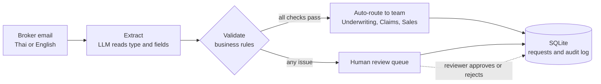

# Thai Insurance Ops Agent

An AI agent that triages insurance broker emails written in Thai or English. It works out what the broker wants, pulls out the key details, checks them against business rules, and either routes the request straight to the right team or holds it for a person to review. Every decision is logged for audit.

Built with **Python, LangGraph, Gemini, FastAPI, Gradio and SQLite**.

> All sample emails, names and policy numbers in this repository are fictional.

## The problem

Operations teams at motor insurers read a steady stream of broker emails: change this address, add a driver, my client had an accident, can you inspect this car, send me a quote. Each one has to be read, understood, checked and passed to the right team by hand. This project automates the routine part and keeps people in charge of anything risky.

## How it works



1. **Extract.** Gemini reads the email and returns structured JSON that must match a schema: request type, confidence, policy number, licence plate, key date, phone and insured name. Thai Buddhist Era dates (for example 15/10/2569 or 15 ต.ค. 69) are converted to the Gregorian calendar.
2. **Validate.** Business rules decide whether a person must check the request (table below).
3. **Route.** Clean requests go straight to the right team. Anything flagged waits in a review queue with the reasons attached.
4. **Save.** Every request, decision and reviewer action is written to SQLite with a timestamp, so the full history can be audited.

The workflow is a [LangGraph](https://github.com/langchain-ai/langgraph) state graph, so new steps (an OCR step for attachments, a second checking agent) can be added as nodes without rewriting the rest.

### Human-in-the-loop rules

| Rule | Why a person checks it |
| --- | --- |
| Request type unclear, or confidence below 0.75 | The model is unsure what the broker wants |
| Required detail missing (for example a claim with no plate) | The team cannot act on it yet |
| Policy number in the wrong format | Likely a typo; must be confirmed before changing a policy |
| Backdated endorsement | Needs underwriter approval |
| Claim incident date in the future | Almost certainly an error |
| Change of insured or transfer of ownership | Compliance requires a person to approve |

## Results

`eval/evaluate.py` scores the agent on 50 labelled emails in Thai, English or both. They include the messy cases real inboxes contain: Thai numerals, Buddhist Era and informal dates, +66 phone numbers, forwarded emails, and look-alike requests such as a claim status enquiry that is not a new claim. Gemini (free tier) against the offline rule-based baseline:

| Metric | Rule-based baseline | Gemini 3.5 Flash-Lite |
| --- | --- | --- |
| Request type | 39/50 (78%) | 50/50 (100%) |
| Routing decision | 40/50 (80%) | 50/50 (100%) |
| Policy number | 49/50 (98%) | 50/50 (100%) |
| Licence plate | 50/50 (100%) | 50/50 (100%) |
| Key date | 35/46 (76%) | 46/46 (100%) |
| Contact phone | 47/50 (94%) | 50/50 (100%) |
| Insured name | 19/20 (95%) | 20/20 (100%) |

The baseline misses informal wording ("ขอแก้ที่อยู่", "replace the vehicle"), Thai month names ("20 ต.ค. 2569") and international phone formats, and mistakes a claim status enquiry for a new claim. Gemini handled all 50 emails correctly. Every mistake is listed in [`eval/results.md`](eval/results.md); run `python eval/evaluate.py` with a Gemini key to reproduce it.

**Caveat:** these 50 emails are synthetic and were written alongside the prompt, so a perfect score here does not mean the agent is perfect on real inboxes. The next step is a blind test set of real, anonymised broker emails.

## Quick start

### In your browser (no installation)

1. Click the green **Code** button on this page, open the **Codespaces** tab and choose **Create codespace on main**.
2. Wait a couple of minutes while it installs everything automatically.
3. In the terminal at the bottom, run `python app.py`. The web demo opens in a new browser tab.

The tests also run automatically on GitHub Actions every time the code changes.

### On your own computer

Requires Python 3.10 or later.

```bash
pip install -r requirements.txt

python app.py                  # web demo in your browser
python eval/evaluate.py        # accuracy on the labelled samples
pytest                         # unit tests
uvicorn api:app --reload       # REST API, docs at http://127.0.0.1:8000/docs
```

**To use the LLM:** copy `.env.example` to `.env` and add a Gemini API key (free from [Google AI Studio](https://aistudio.google.com/apikey)). Without a key, the project runs on the offline rule-based baseline.

## REST API

| Method | Endpoint | What it does |
| --- | --- | --- |
| POST | `/triage` | Triage one email: `{"text": "..."}` |
| GET | `/review-queue` | List requests waiting for a person |
| POST | `/requests/{id}/decision` | Approve or reject: `{"reviewer": "...", "approve": true, "note": "..."}` |
| GET | `/requests/{id}/history` | Audit trail for one request |

## Project structure

```
agent/
  schema.py       Data model for what the agent extracts
  llm.py          Gemini extractor and the offline rule-based baseline
  validators.py   Business rules and team routing
  graph.py        LangGraph workflow
  store.py        SQLite requests, review queue and audit log
app.py            Gradio web demo
api.py            FastAPI REST API
eval/evaluate.py  Accuracy evaluation
data/             Labelled sample emails (fictional)
tests/            Unit and end-to-end tests
```

## Limitations and next steps

- The 13 samples are synthetic. A real deployment would need hundreds of labelled emails and regular re-evaluation.
- Read attachments (PDF policies, photos of damage) with an OCR or vision step.
- Connect to a real inbox and the core policy system through their APIs.
- Let reviewers correct extracted fields and resume the workflow, using LangGraph interrupts and a checkpointer.
- Track accuracy and the share of requests sent for review over time.

## Author

Apichat Chaweewanchon
